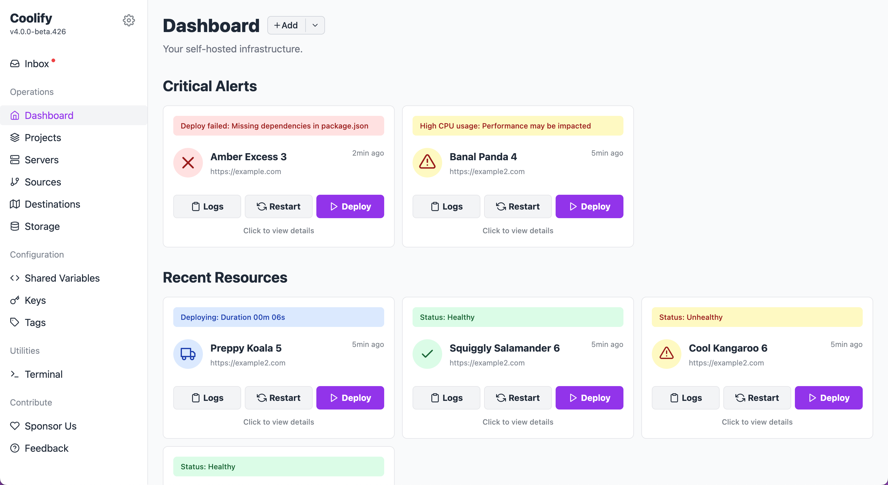

# Coolify Dashboard Ideas — Quick Prototype

This is a **conceptual prototype** for improving the Coolify dashboard UX.  
It’s not a production PR (yet) — I ran into a local environment constraint (disk space) — but I wanted to share the design directions and ideas for discussion.

---

## 🔍 Focus Areas
1. **Hierarchy of resources**  
   - Surfaced the most frequently changed/monitored items (Resources → Projects → Servers).  

2. **Activity Feed / Inbox**  
   - Added a right-side drawer for recent events and notifications.  
   - Mobile-friendly with scrims and off-canvas interactions.  

3. **Navigation Grouping**  
   - Reorganized the left sidebar into clear sections: Operations, Configuration, Utilities, Contribute.  

4. **Expandable Cards**  
   - Critical alerts and resources can expand inline to show details (logs, metrics, access info).  
   - Accordion behavior so only one card is expanded at a time.  

---

## 🎨 Design Notes
- **Light mode mockup** — easier to parse quickly; dark theme could follow the same structure.  
- **Colors are flexible** — the current palette is just for clarity; the core idea is surfacing *status & ops info* more visually.  
- **Minimalist details sections** — resource usage, deployment info, and logs are shown in collapsible layouts.  

---

## ⚡ Quick Start

1. **Clone the repo**  
   ```bash
   git clone https://github.com/pinkhairs/coolify-dashboard-ideas.git
   cd coolify-dashboard-ideas

2. **Open in VS Code**

   * Install the **[Live Preview (by Microsoft)](https://marketplace.visualstudio.com/items?itemName=ms-vscode.live-server)** extension.
   * Right-click on `index.html` → **Show Preview**.
   * VS Code will serve it on a local URL (e.g. `http://127.0.0.1:3000`).
   * ✅ This is the recommended way to ensure JS modules and paths load correctly.

3. **Alternative**

   * You can also just open `index.html` in your browser.
   * ⚠️ However, depending on your browser, JS module imports (`import ... from './file.js'`) may not resolve correctly without a local server.

4. **Explore**

   * Mobile menu (hamburger)
   * Activity feed / inbox
   * Expandable cards (alerts, resources, projects, servers)

---

## 📸 Screenshots



---

## 🚀 How It Works

* Plain HTML, Tailwind (via CDN), and lightweight JS modules.
* Modules include:

  * `mobile-menu.js` → handles the sidebar on small screens.
  * `inbox-feed.js` → toggles the activity drawer.
  * `expandable-cards.js` → expands/collapses details and summary sections.
* Icons provided via [Feather Icons](https://feathericons.com/).

---

## 📂 Structure
```
coolify-dashboard-ideas/
├── index.html              # Main prototype
├── mobile-menu.js          # Mobile nav interactions
├── inbox-feed.js           # Activity feed drawer
├── expandable-cards.js     # Expandable details/summary cards
├── screenshot.png          # Preview image
└── README.md               # This file
```
---

## ⚠️ Notes

* This is a **prototype**, not intended for production use.
* Environment constraints blocked opening a PR directly, so the work is shared here for review and feedback.
* Next step: migrate into a clean environment and open a PR for proper tracking.

---

## 💬 Feedback

Would love input on:

* Does the **hierarchy** (Resources → Projects → Servers) feel right?
* Does the **activity feed** add clarity or noise?
* How would you refine the **color & grouping** choices?